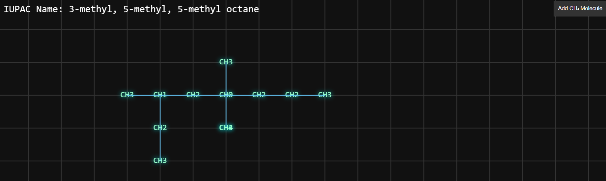

# Basic IUPAC Simulator

The **Basic IUPAC Simulator** is a web-based interactive tool designed to visually simulate the formation of organic molecules like alkanes. The project allows users to add atoms to a canvas and form bonds between them, simulating the structure of organic compounds. It uses Konva.js for rendering and visualizing the atoms and bonds. 

## Features

- Add CH₄ (methane) molecules to the canvas by clicking a button.
- Drag and connect atoms to create chemical bonds.
- Automatically update the display with the IUPAC name of the formed molecule.
- Visualize the connections between atoms with dynamic bond lines.
- Interactive and user-friendly interface.

## Technologies Used
- Konva.js: A canvas library for rendering shapes, lines, and animations.
- HTML5 & CSS3: Basic structure and styling.
- JavaScript: For functionality and logic.

## Contribution
Contributions are welcome! If you'd like to contribute to this project, feel free to fork it, make your changes, and submit a pull request. Please make sure to follow the coding style and include tests for any new features.

## License
This project is open-source and available under the MIT License.

---

**Note**: This is a basic structure and is far from perfect. It was built as a fun project in just a couple of hours, and it may have a number of bugs and issues. Use it as a prototype and feel free to improve it!